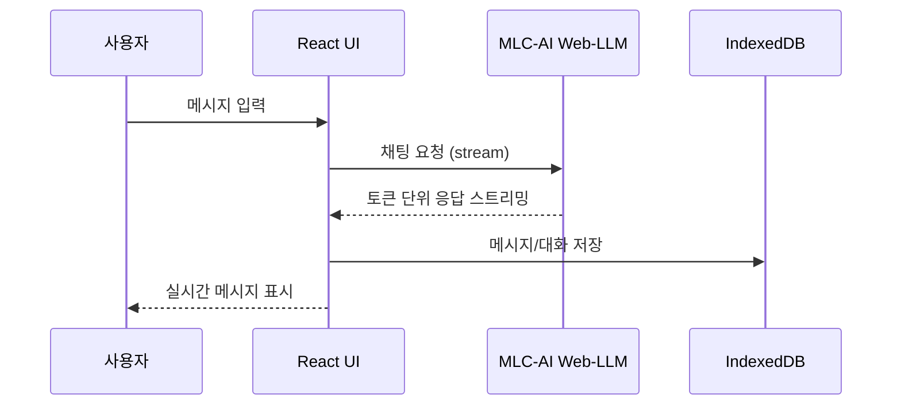
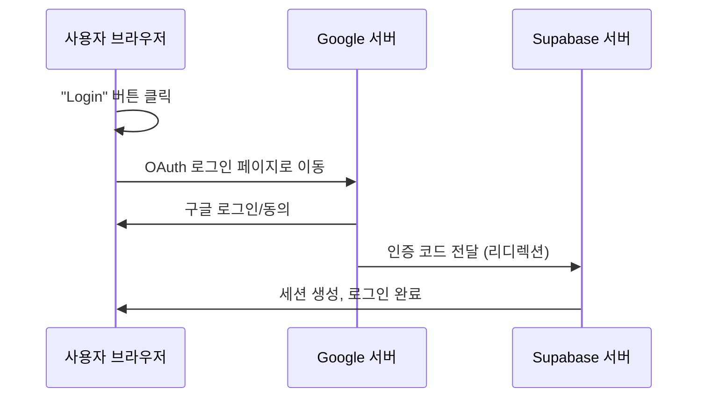

# 02. 기술 아키텍처 (Technical Architecture)

## 전체 시스템 아키텍처 및 디렉토리 구조

```
local-chat/
├── src/
│   ├── app/                # Next.js App Router (layout.tsx, page.tsx, globals.css)
│   ├── components/         # React 컴포넌트
│   │   ├── app-sidebar.tsx         # 사이드바(채팅 목록, 로그인/아바타)
│   │   ├── header-bar.tsx          # 우측 상단 로그인/아바타/로그아웃
│   │   ├── enhanced-chat.tsx       # 메인 채팅 UI
│   │   ├── settings.tsx            # 설정 패널
│   │   ├── chat/                   # 채팅 관련 컴포넌트
│   │   │   ├── chat-input.tsx
│   │   │   ├── chat-messages.tsx
│   │   │   └── index.tsx
│   │   └── ui/                     # 재사용 UI 컴포넌트
│   │       └── button.tsx
│   ├── hooks/              # 커스텀 React 훅
│   │   ├── use-local-chat.ts        # 기본 채팅 로직
│   │   └── use-enhanced-chat.ts     # 다중 세션/고급 채팅
│   └── lib/                # 유틸리티/로컬DB/외부연동
│       ├── db.ts                    # IndexedDB 관리
│       └── utils.ts                 # 기타 유틸 함수
├── public/
│   ├── manifest.json
│   └── sw.js                # PWA 서비스 워커
├── docs/
│   ├── 01.implementation-status.md
│   ├── 02.technical-architecture.md
│   └── ...
├── README.md
└── ...
```

- **app/**: Next.js App Router 기반 페이지/레이아웃/글로벌 스타일
- **components/**: UI, 사이드바, 헤더, 채팅, 설정 등 모든 화면 컴포넌트
- **hooks/**: 채팅/세션/상태 관리용 커스텀 훅
- **lib/**: IndexedDB, 유틸, 외부 API 연동(Supabase 등)
- **public/**: PWA, 정적 파일

---

## 데이터 플로우 및 시퀀스 다이어그램

### (1) 스트리밍 채팅 시퀀스



**핵심 코드 예시**
```typescript
// src/hooks/use-local-chat.ts
const sendMessage = useCallback(async (content: string) => {
  // ...생략
  const completion = await engineRef.current.chat.completions.create({
    messages: newMessages.map(msg => ({ role: msg.role, content: msg.content })),
    stream: true
  })
  for await (const chunk of completion) {
    // 스트리밍 토큰 UI 반영
  }
}, [state.messages, saveMessages])
```

---

### (2) 소셜 로그인(구글 OAuth) 시퀀스



**핵심 코드 예시**
```typescript
// src/components/header-bar.tsx
const handleGoogleLogin = async () => {
  await supabase.auth.signInWithOAuth({ provider: 'google' })
}
```

---

## State Management Layer

- **다중 세션 관리**:  
  - `use-enhanced-chat.ts`에서 여러 대화 세션(채팅방) 생성/전환/삭제/제목 편집 지원
  - 각 세션별 메시지, 메타데이터를 별도로 관리
- **로컬 상태 관리**:  
  - React useState, useCallback, useEffect 등으로 UI/모델 상태, 로딩, 에러, 세션 등 관리
  - 전역 상태는 Context 없이 각 컴포넌트/훅에서 관리(필요시 Context 확장 가능)

---

## Data Storage Layer

- **IndexedDB**:  
  - 대화 세션, 메시지, 메타데이터 등 대용량 구조화 데이터 저장
  - `src/lib/db.ts`에서 트랜잭션 기반 CRUD 제공
- **localStorage**:  
  - 설정, UI 상태, 간단한 프리퍼런스 등 소용량 데이터 저장
- **Cache API**:  
  - PWA 서비스 워커에서 모델/에셋/오프라인 데이터 캐싱

---

## 기타 구현 항목 및 설명

- **PWA**:  
  - `public/sw.js`에서 오프라인 캐싱, 설치 지원, 푸시 알림 준비
- **AI Engine Layer**:  
  - MLC-AI Web-LLM을 브라우저에서 직접 실행, WebAssembly 기반 고성능 추론
- **UI/UX**:  
  - Tailwind CSS, ShadCN UI, Lucide Icons 등으로 반응형/모던 UI 구현
- **소셜 로그인**:  
  - Supabase Auth + Google OAuth 연동, 로그인/아바타/로그아웃 UI 제공

## 전체 시스템 아키텍처

```
┌─────────────────────────────────────────────────────────────────┐
│                        Local Chat PWA                          │
├─────────────────────────────────────────────────────────────────┤
│                    Frontend Layer                              │
│  ┌─────────────┐  ┌─────────────────┐  ┌─────────────────┐   │
│  │   Next.js   │  │     React       │  │   TypeScript    │   │
│  │   App Router│  │   Components    │  │   Type Safety   │   │
│  │   PWA       │  │   Hooks         │  │   Interfaces    │   │
│  └─────────────┘  └─────────────────┘  └─────────────────┘   │
├─────────────────────────────────────────────────────────────────┤
│                    UI/UX Layer                                 │
│  ┌─────────────┐  ┌─────────────────┐  ┌─────────────────┐   │
│  │  Tailwind   │  │   ShadCN UI     │  │   Lucide Icons  │   │
│  │     CSS     │  │   Components    │  │   SVG Icons     │   │
│  │  Styling    │  │   Design System │  │   Visual Assets │   │
│  └─────────────┘  └─────────────────┘  └─────────────────┘   │
├─────────────────────────────────────────────────────────────────┤
│                    State Management                            │
│  ┌─────────────────────────────────────────────────────────┐   │
│  │              React Hooks + Context                     │   │
│  │                                                         │   │
│  │ • useLocalChat() - 기본 채팅 로직                      │   │
│  │ • useEnhancedChat() - 다중 세션 관리                   │   │
│  │ • useState() - 로컬 상태 관리                          │   │
│  │ • useCallback() - 성능 최적화                          │   │
│  └─────────────────────────────────────────────────────────┘   │
├─────────────────────────────────────────────────────────────────┤
│                    Data Storage Layer                          │
│  ┌─────────────┐  ┌─────────────────┐  ┌─────────────────┐   │
│  │  IndexedDB  │  │  localStorage   │  │   Cache API     │   │
│  │             │  │                 │  │                 │   │
│  │ • Messages  │  │ • Settings      │  │ • PWA Assets    │   │
│  │ • Chats     │  │ • Preferences   │  │ • Offline Data  │   │
│  │ • Metadata  │  │ • UI State      │  │ • Model Cache   │   │
│  └─────────────┘  └─────────────────┘  └─────────────────┘   │
├─────────────────────────────────────────────────────────────────┤
│                    AI Engine Layer                             │
│  ┌─────────────────────────────────────────────────────────┐   │
│  │              MLC-AI Web-LLM                            │   │
│  │                                                         │   │
│  │ • Model Loading & Initialization                       │   │
│  │ • Real-time Inference Engine                           │   │
│  │ • Streaming Response Generation                         │   │
│  │ • Browser-based AI Processing                          │   │
│  │ • WebAssembly Optimization                             │   │
│  └─────────────────────────────────────────────────────────┘   │
└─────────────────────────────────────────────────────────────────┘
```

## 컴포넌트 아키텍처

### 핵심 컴포넌트 구조

```
src/
├── app/                          # Next.js App Router
│   ├── layout.tsx               # 루트 레이아웃 (PWA 등록)
│   ├── page.tsx                 # 메인 페이지
│   └── globals.css              # 전역 스타일
├── components/                   # React 컴포넌트
│   ├── chat/                    # 채팅 관련 컴포넌트
│   │   ├── index.tsx            # 메인 채팅 컴포넌트
│   │   ├── chat-messages.tsx    # 메시지 표시 컴포넌트
│   │   └── chat-input.tsx       # 입력 컴포넌트
│   ├── ui/                      # 재사용 가능한 UI 컴포넌트
│   │   └── button.tsx           # 버튼 컴포넌트
│   ├── enhanced-chat.tsx        # 향상된 채팅 컴포넌트
│   ├── settings.tsx             # 설정 패널
│   └── enhanced-sidebar.tsx     # 향상된 사이드바
├── hooks/                       # 커스텀 React 훅
│   ├── use-local-chat.ts        # 기본 채팅 로직
│   └── use-enhanced-chat.ts    # 다중 세션 지원
└── lib/                         # 유틸리티 및 라이브러리
    ├── db.ts                    # IndexedDB 관리
    └── utils.ts                 # 유틸리티 함수
```

### 데이터 플로우 다이어그램

```
┌─────────────┐    ┌─────────────┐    ┌─────────────┐
│   User      │    │   React     │    │   MLC-AI    │
│  Input      │───▶│  Component  │───▶│  Web-LLM    │
└─────────────┘    └─────────────┘    └─────────────┘
       │                   │                   │
       │                   ▼                   ▼
       │            ┌─────────────┐    ┌─────────────┐
       │            │   State     │    │   Model     │
       │            │ Management  │    │ Processing  │
       │            └─────────────┘    └─────────────┘
       │                   │                   │
       ▼                   ▼                   ▼
┌─────────────┐    ┌─────────────┐    ┌─────────────┐
│   UI        │    │ IndexedDB   │    │ Streaming   │
│  Update     │◀───│  Storage    │◀───│  Response   │
└─────────────┘    └─────────────┘    └─────────────┘
```

## 핵심 기술 상세

### 1. MLC-AI Web-LLM 통합

```typescript
// src/hooks/use-local-chat.ts
const initializeEngine = useCallback(async () => {
  const { CreateMLCEngine } = await import('@mlc-ai/web-llm')
  
  const MODEL_ID = 'Llama-3.1-8B-Instruct-q4f32_1-MLC'
  
  engineRef.current = await CreateMLCEngine(MODEL_ID, {
    initProgressCallback: (progress) => {
      setState(prev => ({ 
        ...prev, 
        modelStatus: progress.text 
      }))
    }
  })
}, [])
```

**주요 특징:**
- 동적 임포트로 SSR 호환성 확보
- 진행률 콜백으로 사용자 피드백 제공
- WebAssembly 기반 고성능 추론
- 브라우저 메모리에서 직접 실행

### 2. IndexedDB 데이터 관리

```typescript
// src/lib/db.ts
class LocalDatabase {
  async init(): Promise<void> {
    const request = indexedDB.open(DB_NAME, DB_VERSION)
    
    request.onupgradeneeded = (event) => {
      const db = event.target.result
      
      // 대화 저장소 생성
      if (!db.objectStoreNames.contains(CONVERSATIONS_STORE)) {
        const store = db.createObjectStore(CONVERSATIONS_STORE, { keyPath: 'id' })
        store.createIndex('createdAt', 'createdAt', { unique: false })
      }
      
      // 메시지 저장소 생성
      if (!db.objectStoreNames.contains(MESSAGES_STORE)) {
        const store = db.createObjectStore(MESSAGES_STORE, { keyPath: 'id' })
        store.createIndex('conversationId', 'conversationId', { unique: false })
      }
    }
  }
}
```

**주요 특징:**
- 스키마 버전 관리
- 인덱싱으로 빠른 검색
- 트랜잭션 기반 데이터 무결성
- 대용량 데이터 효율적 처리

### 3. PWA 구현

```javascript
// public/sw.js
const CACHE_NAME = 'local-chat-v1'
const urlsToCache = ['/', '/manifest.json']

self.addEventListener('install', (event) => {
  event.waitUntil(
    caches.open(CACHE_NAME)
      .then((cache) => cache.addAll(urlsToCache))
  )
})

self.addEventListener('fetch', (event) => {
  event.respondWith(
    caches.match(event.request)
      .then((response) => response || fetch(event.request))
  )
})
```

**주요 특징:**
- 오프라인 캐싱 지원
- 네이티브 앱 설치 가능
- 백그라운드 동기화
- 푸시 알림 준비

## 성능 최적화 전략

### 1. 메모리 관리
- 모델 로딩 시 메모리 사용량 모니터링
- 불필요한 컴포넌트 언마운트 시 메모리 해제
- 가비지 컬렉션 최적화

### 2. 렌더링 최적화
- React.memo로 불필요한 리렌더링 방지
- useCallback과 useMemo로 함수/값 메모이제이션
- 가상화된 리스트로 대용량 메시지 처리

### 3. 데이터 최적화
- IndexedDB 인덱싱으로 빠른 검색
- 페이지네이션으로 대용량 데이터 처리
- 압축된 모델 파일 사용

## 보안 고려사항

### 1. 로컬 데이터 보안
- 모든 데이터가 사용자 기기에만 저장
- 브라우저 보안 정책 준수
- 민감한 정보 암호화 (향후 구현)

### 2. AI 모델 보안
- 로컬에서만 추론 실행
- 네트워크 전송 없음
- 사용자 데이터 외부 전송 없음

## 확장성 설계

### 1. 모듈화된 구조
- 컴포넌트별 독립적 개발 가능
- 플러그인 방식의 기능 확장
- 마이크로프론트엔드 준비

### 2. API 설계
- RESTful API 준비 (향후 클라우드 연동)
- GraphQL 스키마 설계
- WebSocket 실시간 통신 준비

### 3. 데이터베이스 설계
- 마이그레이션 시스템
- 백업 및 복원 기능
- 데이터 버전 관리 